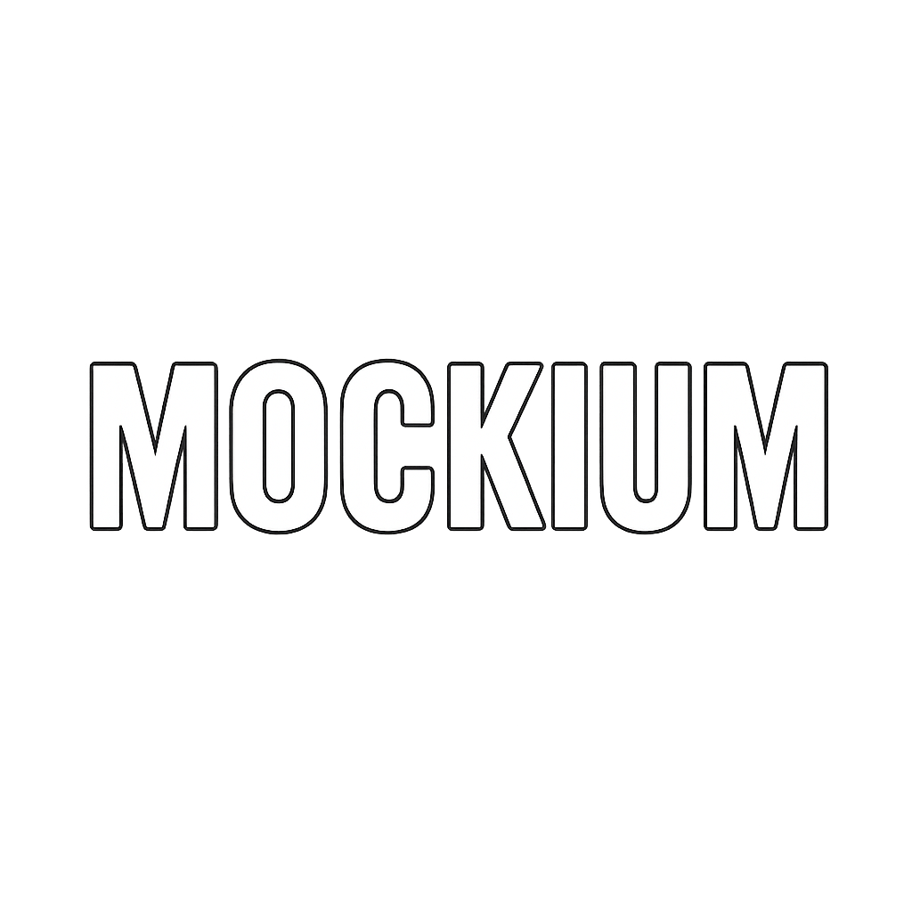

<div align="center">



[](LICENSE.md)
</div>

<h1 align="center">⚡Welcome to Mockium⚡</h1>

**Mockium** is a fast and convenient service for mocking REST API requests. It allows you to easily create, test, and simulate HTTP API behavior without needing to implement a real backend.

<br />

## About the Project 🚀

Mockium is an open-source tool that speeds up the development and testing of client applications. It allows you to create custom responses for HTTP requests, making it useful for frontend developers, testers, and integrators.

Mockium reduces dependency on a real backend, enables rapid API integration testing, allows mocking of any responses and scenarios, and logs requests to mocks.

<br />

## Features ⭐

- **Request Routing 🔀**  
  &nbsp; Flexible path and method configuration for mocks.
- **Response Mocking 📝**  
  &nbsp; Return any data for predefined requests.
- **Response Templates 📄**  
  &nbsp; Use templates for dynamic response generation.
- **Request Logging 📋**  
  &nbsp; Detailed logging of all requests to the service.
- **Quick Start 🚀**  
  &nbsp; Minimal setup, ready to use out of the box.
- **Unit Test Support ✅**  
  &nbsp; Built-in tests for reliability and stability.

<br />

## Documentation 📕

For detailed information and usage examples, see the [Documentation](docs/README.md).

## Quick Start

1. Install dependencies:
    ```sh
    go mod tidy
    ```

3. Add folder with templates.

3. Build and run the service:
    ```sh
    go run cmd/app.go  --dir /path/to/templates/folder --address :8080
    ```


## Contributing 🙏

We welcome all pull requests — bug fixes, improvements, new features. Your contribution will help make Mockium better for everyone!

<br />
<br />
<br />
